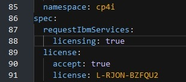

## My ROKS
1. Use [IBM Techzone](https://techzone.ibm.com/) to install OpenShift. Use "Cloud Pak for Integration Activation Kit".  When available, follow instructions on [DemoHub](https://ibm-garage-tsa.github.io/cp4i-demohub/overview/) to install Cloud Pak for Integration.

### License Service
By default license serivice is not activated. For instructions, see [Deploying License Service](https://www.ibm.com/docs/en/cloud-paks/cp-integration/2021.2?topic=service-deploying-license-cloud-pak-integration)

### HowTo
From OpenShift console > Installed Operators, find the "IBM Cloud Pak for Integration Platform Navgator". Go to "Platform Navigator" tab, and open the yaml. Add the following two lines in the "spec" section:
------
`spec

  requestIbmServices:
   licensing: true`
------
Then save it. I've found that if I take too long to update and save, that a newer version of the yaml must be loaded, so I guess something is updating it in the background. So, make the update fast and save it.  Before I saved it, it looks like:

-----------------------------------------------

## Welcome to GitHub Pages

You can use the [editor on GitHub](https://github.com/francoisvdm/MyROKS/edit/gh-pages/index.md) to maintain and preview the content for your website in Markdown files.

Whenever you commit to this repository, GitHub Pages will run [Jekyll](https://jekyllrb.com/) to rebuild the pages in your site, from the content in your Markdown files.

### Markdown

Markdown is a lightweight and easy-to-use syntax for styling your writing. It includes conventions for

```markdown
Syntax highlighted code block

# Header 1
## Header 2
### Header 3

- Bulleted
- List

1. Numbered
2. List

**Bold** and _Italic_ and `Code` text

[Link](url) and 
```

For more details see [GitHub Flavored Markdown](https://guides.github.com/features/mastering-markdown/).

### Jekyll Themes

Your Pages site will use the layout and styles from the Jekyll theme you have selected in your [repository settings](https://github.com/francoisvdm/MyROKS/settings/pages). The name of this theme is saved in the Jekyll `_config.yml` configuration file.

### Support or Contact

Having trouble with Pages? Check out our [documentation](https://docs.github.com/categories/github-pages-basics/) or [contact support](https://support.github.com/contact) and we’ll help you sort it out.
