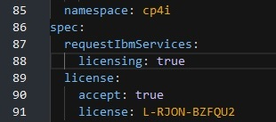
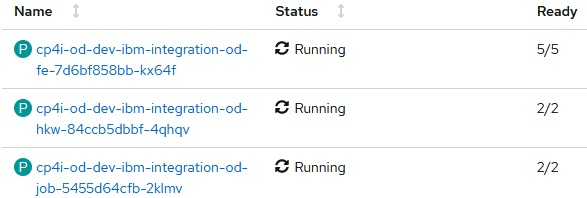

# My ROKS
1. Use [IBM Techzone](https://techzone.ibm.com/) to install OpenShift. Use "Cloud Pak for Integration Activation Kit".  When available, follow instructions on [DemoHub](https://ibm-garage-tsa.github.io/cp4i-demohub/overview/) to install Cloud Pak for Integration.

## License Service
By default license serivice is not activated. For instructions, see [Deploying License Service](https://www.ibm.com/docs/en/cloud-paks/cp-integration/2021.2?topic=service-deploying-license-cloud-pak-integration)

### HowTo
From _OpenShift console -> Installed Operators_, find the "IBM Cloud Pak for Integration Platform Navigator" operator. Go to "Platform Navigator" tab, and open the yaml. Add the following two lines in the "spec" section:

```YAML
 requestIbmServices:
  licensing: true
```

Then save it. I've found that if I take too long to update and save, that a newer version of the yaml must be loaded, so I guess something is updating it in the background. So, make the update fast and save it.  Before I saved it, it looks like:



To test the above:
Test to see if licensing pod is running: kubectl get pod --all-namespaces | findstr ibm-licensing-operator

License Service aggregate data every 5 min. but License Service Reporter import data in daily schedule. If you see the data in License Service and you need to see those data in License Service Reporter you may “force” upload deleting ibm-licensing-service-instance-xxxxx pod, it will be recreated and after 6 min it will send data to License Service Reporter.

## License Service Reporter

Deploy the License Service Reporter: See [Deploying License Service Reporter](https://www.ibm.com/docs/en/cloud-paks/cp-integration/2021.2?topic=SSGT7J_21.2/license-service/1.x.x/license_reporter_deployment.html#lrcons)

## Operations Dashboard
In ROKS I'veconfigured RWX as _File Gold_ storage and RWO as _Block Gold_ storage. After installation several minutes before it goes to ready.

Will not go ready until you see the following in OpenShift Pods:



## MQ
### Create queue managers
QM1 - basic non-production
* Availability = Single Instance
* Enable tracing = no

QM2 - production
* Availability = Single Instance
* Storage = CP4I Block Performance
* Volume = peristent-claim
* Enable tracing = no

QM3 - production
* Availability = Single Instance
* Storage = CP4I Block Performance
* Volume = Persistent-claim
* Enable tracing = yes

### Configuration
Remove channel security - Under queue manager _communication_ change _CHLAUTH records_ to _Disabled_.

## ACE
### Create integration dashboards
ACE1 - non-production
* Replicas - 1
* Storage - ibmc-file-bronze-gid
* Storage type - persistent-claim


## Integration tracing
### Create am instance
cp4i-od-dev
* Storage (config db) - ibmc-file-gold-gid
* Storage (shared) - ibmc-file-gold-gid
* Storage (tracing) - ibmc-block-gold
-----------------------------------------------

## Test Applications

### App 1
ACE Message Flow generate a simple MQ message every x seconds and put it on queue ? queue manager

### App 2
ACE Message Flow gets message from queue x and puts it to queue z. 


## Ticklist
* Install OpenShift
* Install CP4I
* Create non-production queue manager
* Configure queue manager
** Remove security
* Create non-production ACE
* Configure license service
* Deploy License service reporter
* Deploy ACE flow _ROKS-ticker-MFP_ - this flow pops a message on a queue every x seconds


## Welcome to GitHub Pages

You can use the [editor on GitHub](https://github.com/francoisvdm/MyROKS/edit/gh-pages/index.md) to maintain and preview the content for your website in Markdown files.

Whenever you commit to this repository, GitHub Pages will run [Jekyll](https://jekyllrb.com/) to rebuild the pages in your site, from the content in your Markdown files.

### Markdown

Markdown is a lightweight and easy-to-use syntax for styling your writing. It includes conventions for

```markdown
Syntax highlighted code block

# Header 1
## Header 2
### Header 3

- Bulleted
- List

1. Numbered
2. List

**Bold** and _Italic_ and `Code` text

[Link](url) and 
```

For more details see [GitHub Flavored Markdown](https://guides.github.com/features/mastering-markdown/).

### Jekyll Themes

Your Pages site will use the layout and styles from the Jekyll theme you have selected in your [repository settings](https://github.com/francoisvdm/MyROKS/settings/pages). The name of this theme is saved in the Jekyll `_config.yml` configuration file.

### Support or Contact

Having trouble with Pages? Check out our [documentation](https://docs.github.com/categories/github-pages-basics/) or [contact support](https://support.github.com/contact) and we’ll help you sort it out.
